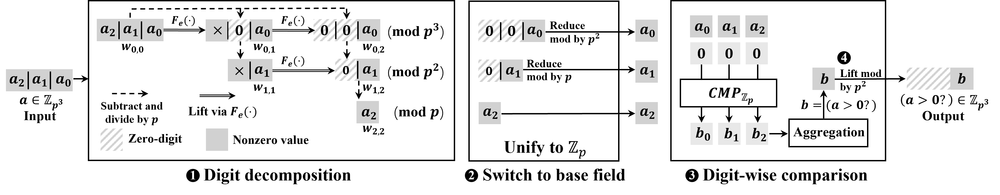
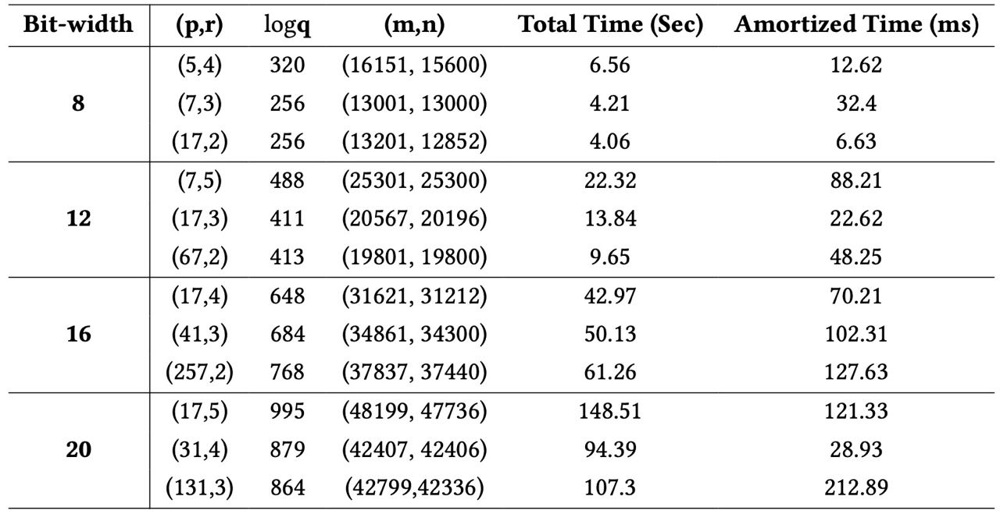
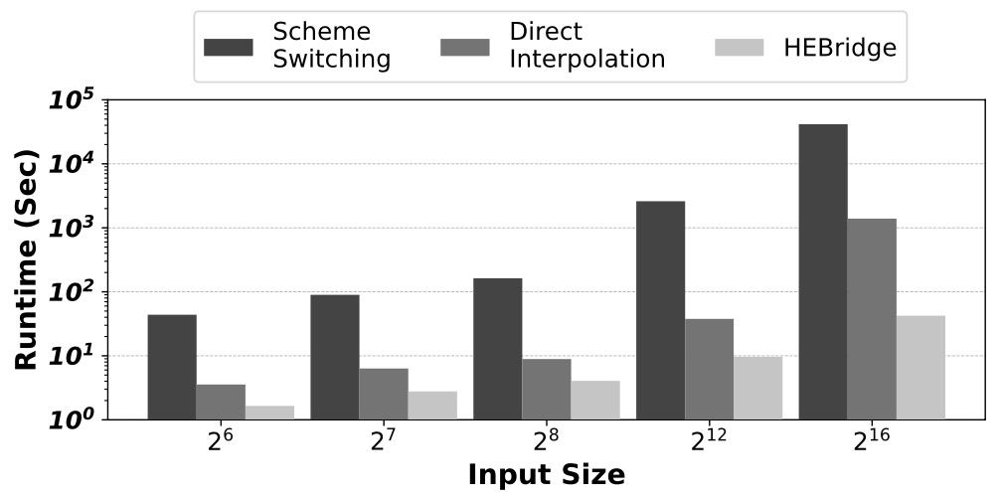
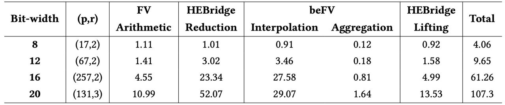

# HEBridge: Connecting Arithmetic and Logic Operations in FV-style HE Schemes

This is a demo code for HEBridge: Connecting Arithmetic and Logic Operations in FV-style HE Schemes (in CCS WAHC'24).



Our implementaion is based on HElib and polynomial interpolation-based methods for FV-style HE schemes, such as [Faster Comparison](https://eprint.iacr.org/2021/315). Please note that the codes are still under development and should not be used in any security-sensitive environments. Future version of this code will be released soon.

## Build and installation
Before building and installing HElib, please add the functions in ```src/Ctxt.h``` (in this project) to ```include/helib/Ctxt.h``` (in the source code of HElib). Then, follow the instruciton in [HElib](https://github.com/homenc/HElib) for installation. After installation, add the path of HElib to the makefile, ```src/CMakeLists.txt```,  as:

    set(helib_DIR ".../helib_install/helib_pack/share/cmake/helib")

Once HElib is installed, you can build this project. Under the  ```./src``` directory, run

    mkdir build && cd build

and then, run:

    cmake ..

finally, build the project by:

    make

## Testing
### Switch from FV to beFV and evaluate logic operaions
A simple test includes (1) the reduction function, which map the input from FV to beFV. (2) the evaluation in beFV, i.e., an interpolation polynomial of degree p. (3) Lifting from beFV to FV. We provide some parameter settings as follows:
  
    ./bin/bridge_circuit p=3 r=4 m=14401 b=300 t=64

    ./bin/bridge_circuit p=5 r=4 m=25351 b=512 t=64
    
    ./bin/bridge_circuit p=67 r=2 m=31159 b=690 t=64
    
where:
- **p**: a prime number for the base plaintext modulus in beFV.
- **r**: a positive integer denoting the power of prime. The plaintext modulus in FV is \(p^r\).
- **q**: the initial ciphertext modulus.
- **t**: the Hamming weight of sk.
- **m**: the cyclotomic order of the polynomial ring.
- **n**: the degree of the polynomial ring, where \(n = \Phi(m)\).
- **d**: the multiplicative order of \(p\) modulo \(m\). \(d\) is the smallest positive integer such that \(p^d = 1 mod m\).
- **ℓ**: the number of SIMD slots. ℓ satisfies the following relationship with \(n\) and \(d\): \(n=ℓd\).

We use uni-variate interpolation polynomials only. Parameter can be chosen differently according to the input bit-width.

## Running HEBridge
To make sure you are in the good position, we provide the logs from a successful running. By executing the command above, you are excpeted to see the following logs:

Encryption paramaters. This step indicates HElib is propoerly installed.

    m=25351, p=5, r=4, bits=512, c=2, skHwt=64
    Initialising context object...
        m = 25351, p = 5, phi(m) = 25000
        ord(p) = 25
        normBnd = 1.62099
        polyNormBnd = 5.34473
        factors = [101 251]
        generator 3 has order (== Z_m^*) of 500
        generator 16565 has order (== Z_m^*) of 2
    [param] getP(): 5
    [param] getR(): 4
    [param] getP2R(): 625
    [param] order(p) = 25

Initialization. This step generates the interpolation polynomials according to the parameters.

    Creating secret key...
    Generating key-switching matrices...
    [test] comparator begin
    [construct] gen mask
    All masks are created
    [construct] gen interpolation poly
    Creating comparison polynomial
    Comparison polynomial is created
    [construct] done

Running HEBridge tests.

    Run 0 started
    [Initial] Airthmetic value (in FV), capacity=485.219, p^r=625
    [Reduction] FV to beFV
    [Reduction] p=5
    [Reduction] r=4
    [Reduction] ptxtSpace=625
    [Reduction] Reduced to: 4 digits
    [Reduction] Reduced digits (in beFV), capacity=285.988, p^r=5
    [beFV] Interpolation: compute the less-than and equality functions modulo p
    [beFV] Aggregation
    [beFV] Logic result (in beFV), capacity=207.039, p^r=5
    [beFV] Success
    [Lifting] beFV to FV
    [Lifting] Logic result after lifting (in FV), capacity=87.9929, p^r=625

Runtime breakdown. We use the built-in timer in HElib to log the runtime of each component.
 
    Reduction: 7.36832 / 1 = 7.36832
    ComparisonCircuitUnivar: 2.9488 / 4 = 0.737201  
    Aggregation: 1.40994 / 1 = 1.40994  
    Lifting: 2.21491 / 1 = 2.21491  
    ReLU: 11.7568 / 1 = 11.7568  

Result verification. We generate ramdom numbers for testing. Under SIMD, ℓ ReLU functions can be computed in paralell. Here we show the first 10 random inputs and the decrypted results.

    Input: 312 127 110 -276 166 -296 100 167 -46 173
    Decrypted ReLU: [312] [127] [110] [0] [166] [0] [100] [167] [0] [173]
    Expected Sign: 1 1 1 0 1 0 1 1 0 1
    Decrypted Sign: [1] [1] [1] [0] [1] [0] [1] [1] [0] [1]

## Reproducing the results
### Arith-ReLU benchmark
After building, to test the first the row of the table, run ```./bin/bridge_circuit p=5 r=4 m=16151 b=320 t=64```. Other rows can be tested similarly. To Total Time is in the ```ArithReLU``` part in the results. The amortized time can be computed by dividing the total time with the number of slots.


### Comparison with existing works
The direct interpolation methods is based on the univariate interpolation in [Faster Comparison](https://eprint.iacr.org/2021/315). The interpolation is done over $\mathbb{F}_p$ for some large prime $p$ such that $p\approx2^b$ where $b$ is the bit-width of the input. The LWE or RLWE conversion is the main bottleneck of schemeswitching, we approximate the time of shceme switching accordingly. For HE bridge, run ```./bin/bridge_circuit p=17 r=2 m=13201 b=256 t=64``` to get the latency for 8-bit inputs.


### Runtime breakdown
For example, to for $(p,r)=(31,4)$, run ```./bin/bridge_circuit p=31 r=4 m=42407 b=879 t=64``` to get the breakdown. You should see results similar to the following:

    Linear: 3.10322 / 1 = 3.10322  
    Reduction: 46.3224 / 1 = 46.3224
    ComparisonCircuitUnivar: 19.1163 / 4 = 4.77909
    Aggregation: 2.57308 / 1 = 2.57308
    Lifting: 16.8179 / 1 = 16.8179
    ArithReLU: 91.0435 / 1 = 91.0435

The runtime breakdown for other tests can be obtained similarly.

